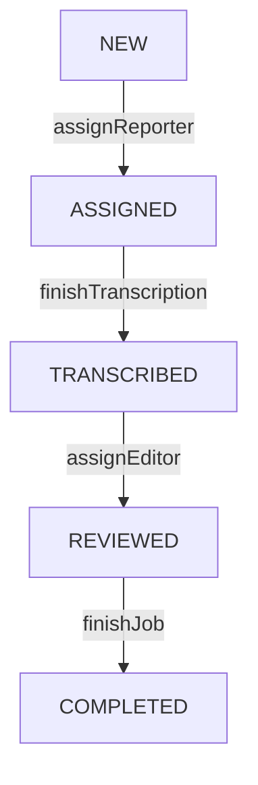
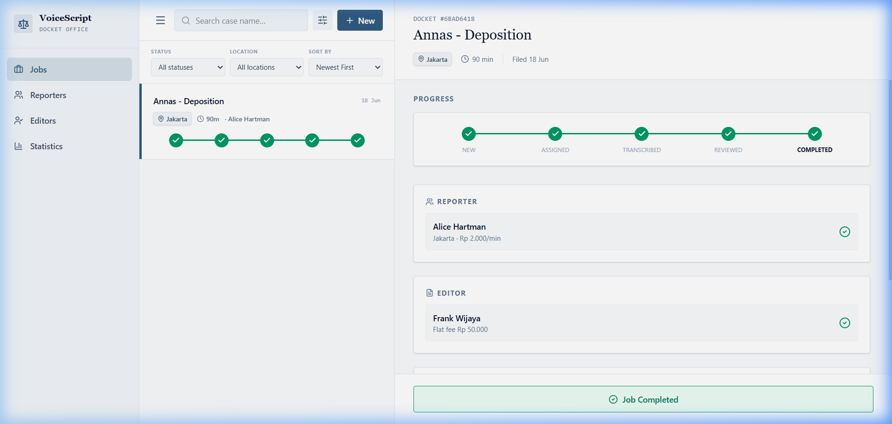
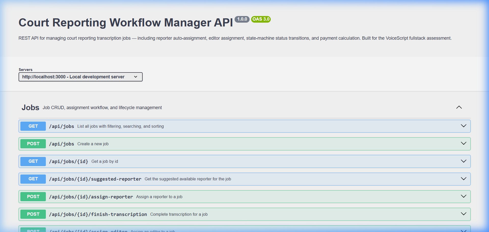

# Court Reporting Workflow Manager

A comprehensive, production-grade fullstack application for managing court reporting transcription jobs, assigning available reporters and editors, tracking state-machine progression, and automatically calculating payments.

---

## 🚀 Tech Stack

The application is structured as a monorepo containing a modern Express backend and a React frontend.

### Backend
*   **Runtime & Language:** Node.js + TypeScript
*   **Framework:** Express v5 (handling routing, async handlers, and middelewares)
*   **ORM:** Prisma v7
*   **Database:** SQLite (default for development/testing) or PostgreSQL (supported for production)
*   **Request Validation:** Zod schemas running at HTTP boundaries
*   **Interactive Docs:** Swagger UI (generated via `swagger-jsdoc` & `swagger-ui-express`)

### Frontend
*   **Framework:** React + TypeScript (scaffolded via Vite)
*   **State Management:** Zustand (for lightweight, reactive store stores)
*   **Styling:** Modern styling variables & Tailwind CSS (responsive layouts, modern CSS variables, premium aesthetics)
*   **Icons:** Lucide React

### Testing
*   **Testing Framework:** Vitest (runs isolated sqlite database contexts for tests)

---

## 🛠️ Getting Started

Follow these steps to clone, configure, and boot the application locally:

### 1. Clone the Repository
```bash
git clone <repository-url>
cd voicescript-tech-test
```

### 2. Install Dependencies
Installs packages for both the backend and the frontend workspace:
```bash
npm install
```

### 3. Initialize the Database
Generate Prisma client files and run the SQLite migrations:
```bash
npx prisma migrate dev --name init
```

### 4. Seed Development Data
Seed the local database with initialavailable court reporters and editors:
```bash
npm run prisma:seed
```
### 5. Build Application for Production
To compile the TypeScript backend and bundle the React frontend assets:
```bash
npm run build
```

### 6. Start Development Server
Start the concurrent development runner to boot both the backend Express watcher and the frontend Vite HMR server in parallel:
```bash
npm run dev
```

*   💻 **Frontend Dashboard (with HMR):** Open [http://localhost:5173](http://localhost:5173) (Use this during development for instant hot-reloading!)
*   🔌 **Express Backend API Server:** Runs on [http://localhost:3000](http://localhost:3000) (React client requests to `/api` are automatically proxied here)
*   📚 **Swagger API Docs:** Open [http://localhost:3000/api/docs](http://localhost:3000/api/docs)
*   🔍 **Service Health Check:** Open [http://localhost:3000/api/health](http://localhost:3000/api/health)

> [!NOTE]
> The backend server on `http://localhost:3000` serves the *built* static frontend assets from the `/public` folder. If you visit `http://localhost:3000` directly, any edits to your React source code will not reflect until you run `npm run build` again. For real-time feedback with instant hot-reloading (HMR), always develop using `http://localhost:5173`.

---

## 🔄 Job Logic Process

The application implements a strict state-machine workflow to manage court reporting jobs. All transitions and state-dependent records are handled transactionally in [jobs.service.ts](src/modules/jobs/jobs.service.ts) to guarantee database consistency:



### 1. Job Creation (`NEW`)
- Creates a job with case metadata (`caseName`, `durationMin`, `locationType`, `city`).
- If `locationType` is `PHYSICAL`, the `city` field is required. If `REMOTE`, `city` is optional.
- Initial job status is set to `NEW`.

### 2. Reporter Assignment (`ASSIGNED`)
- **Action**: `assignReporter(jobId, reporterId?)`
- **Validation**: Enforces state transition from `NEW` to `ASSIGNED`.
- **Selection**:
  - If a specific `reporterId` is provided, checks if they are available.
  - If omitted, auto-assigns the best suggested reporter using the ranking logic:
    - **Physical Job**: Filters available reporters in the same city, sorted by lowest rate per minute first.
    - **Remote Job**: Filters any available reporter, sorted by lowest rate per minute first.
- **Side Effects**:
  - Sets `job.status` to `ASSIGNED` and binds `job.reporterId`.
  - Marks the assigned reporter as unavailable (`available = false`).
  - Calculates and registers `reporterPayout = reporter.ratePerMinute * job.durationMin` in the `Payment` table.

### 3. Transcription Completion (`TRANSCRIBED`)
- **Action**: `finishTranscription(jobId)`
- **Validation**: Enforces transition from `ASSIGNED` to `TRANSCRIBED`.
- **Side Effects**:
  - Releases the reporter, marking them as available again (`available = true`).
  - Sets `job.status` to `TRANSCRIBED`.

### 4. Editor Assignment (`REVIEWED`)
- **Action**: `assignEditor(jobId, editorId)`
- **Validation**: Enforces transition from `TRANSCRIBED` to `REVIEWED`.
- **Selection**: Checks if the chosen editor exists and is available.
- **Side Effects**:
  - Sets `job.status` to `REVIEWED` and binds `job.editorId`.
  - Marks the editor as unavailable (`available = false`).
  - Calculates and registers `editorPayout = editor.flatFee` and updates `totalPayout = reporterPayout + editorPayout` in the `Payment` table.

### 5. Job Completion (`COMPLETED`)
- **Action**: `finishJob(jobId)`
- **Validation**: Enforces transition from `REVIEWED` to `COMPLETED`.
- **Side Effects**:
  - Releases the editor, marking them as available again (`available = true`).
  - Finalizes `job.status` to `COMPLETED` and locks in payment records.

---

## 📸 Screenshots

### Interactive React Dashboard
The frontend displays real-time statistics, active job dockets, state progress steppers, and detailed payout summaries:



### Swagger API Documentation
Interactive OpenAPI docs are exposed at `/api/docs` to test endpoints and explore payload schemas:



---


## 🧪 Running Tests

Integration and unit tests run against an isolated database configuration (`prisma/test.db`) to preserve your local development data:

```bash
npm test
```

This commands automatically:
1. Bootstraps a separate database environment.
2. Synchronizes the Prisma schema.
3. Runs the test suites sequentially (including jobs workflow, reporter ranking, editor filtering, and state transitions).

---

## 📦 Production Builds

To compile and build the codebase for production environments:

```bash
# Compile TypeScript backend and bundle React frontend via Vite
npm run build

# Start the compiled server
npm start
```
The compiled files are emitted to `dist/`, and static assets are bundled into `public/`.

---

## 📚 Documentation Index

| Document | Purpose & Summary |
| --- | --- |
| **[docs/API.md](./docs/API.md)** | Full REST endpoint reference. Documents all routes (such as `/api/jobs`, `/api/reporters`, `/api/editors`, `/api/statistics`), JSON schemas, status transition rules, payment calculation formulas, and error response structures. It specifically covers the singular `/api/jobs/:id/suggested-reporter` endpoint returning a single reporter object or `null`. |
| **[docs/ARCHITECTURE.md](./docs/ARCHITECTURE.md)** | Detailed architecture overview. Describes the layered clean-architecture (Controller, Service, Domain models), pure business rule validations, status transitions, scoring logic for assignments, monorepo directory mapping, and test database isolation. |
| **[docs/DEPLOYMENT.md](./docs/DEPLOYMENT.md)** | Production configuration guide. Discusses environment variables (`NODE_ENV`, `PORT`, `DATABASE_URL`), instructions on migrating from SQLite to PostgreSQL, Nginx reverse proxy server blocks, Dockerfile setups, and health-checking. |
| **[frontend/README.md](./frontend/README.md)** | Frontend-specific documentation. Details the React 19 + Vite 8 + Tailwind CSS 4 setup, Zustand client state stores, API services, component hierarchy map, and development guidelines. |

